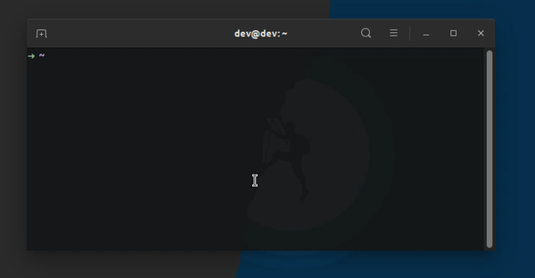

# Spreaded theme
Theme based on [Elessar](https://github.com/fjpalacios/elessar-theme/blob/master/elessar.zsh-theme).



## Installation
First download Spreaded theme:
```console
  $ mkdir -p $ZSH_CUSTOM/themes && curl https://raw.githubusercontent.com/jaycverg/spreaded-theme/master/spreaded.zsh-theme -L -o $ZSH_CUSTOM/themes/spreaded.zsh-theme
```

Then set the theme in your **~/.zshrc** file: 
```
  ZSH_THEME="spreaded"
```

Pull requests are welcome! =)
